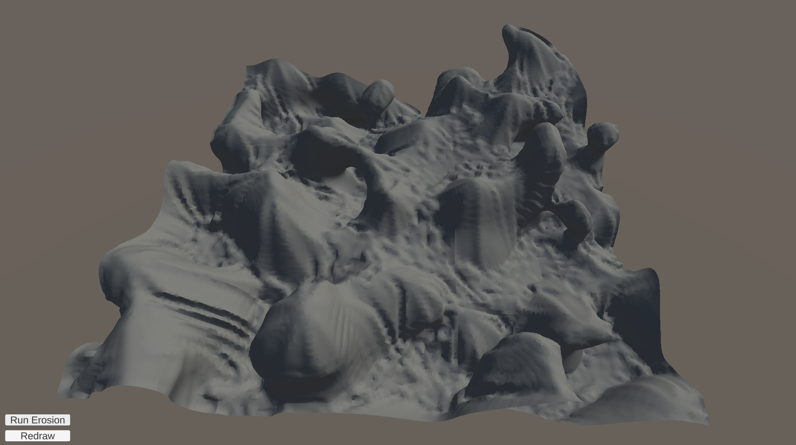

# Procedural Terrain Generation Using Marching Cubes and Hydraulic Erosion
#### By An Duong

## Description
This project is a terrain generator implemented in Unity and utilizing marching cubes, noise functions, and hydraulic erosion. The voxel structure used to store voxel density information also stores each voxel's vertex materials.

## Usage
First start by opening the SampleScene scene once the project has been opened in Unity. Variables such as amount of droplets per chunk and the amount of droplets to be simulated before remeshing the terrain can be changed from the ErosionManager class within the scene, in inspector view in Edit Mode. You can also choose the material to be deposited onto the terrain when droplets stop. The terrain can be changed by switching the biome type in the ChunkManager class. When running the scene use the WASD keys to navigate and the Q and E keys to increase of decrease altitude. Pressing the left Alt key will unlock the cursor, alowing the user to run an erosion simulation of the specified droplets per chunk. The program will automatically remesh the terrain when the erosion process has finished.

Smaller amounts of droplets will decrease simulation time.
A lower droplet refresh rate will increase erosion accuracy but will also increase simulation time.

## Results
##### Before Erosion

##### After Erosion at 4000 droplets per chunk with 100 droplet refresh rate

##### Before Erosion

##### After Erosion at 400 droplets per chunk with 10 droplet refresh rate

##### Before Erosion

##### After Erosion

